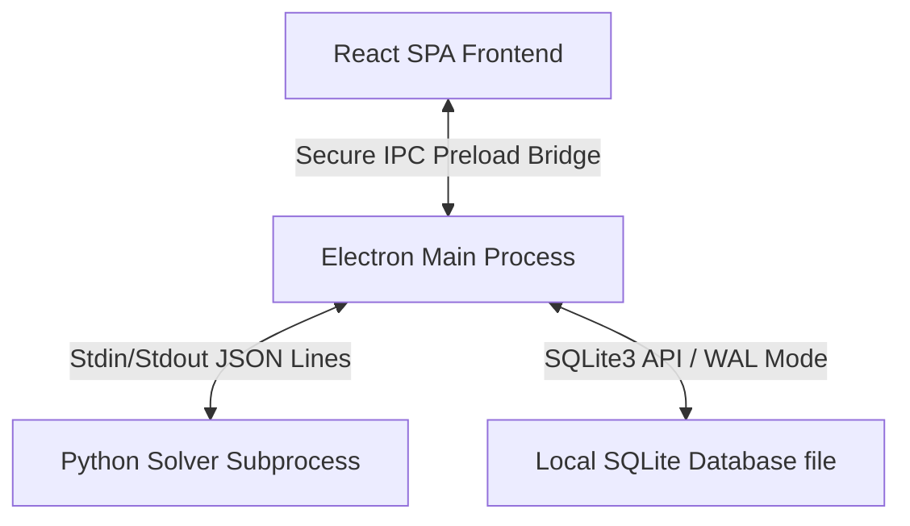
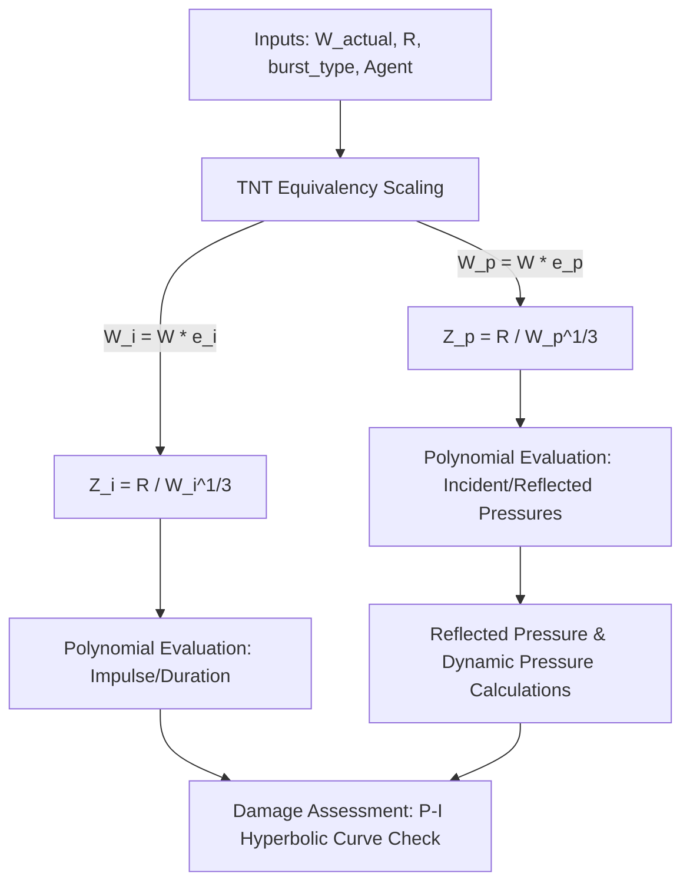
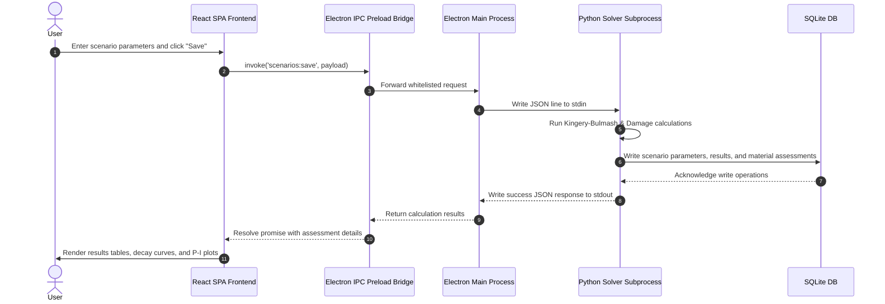
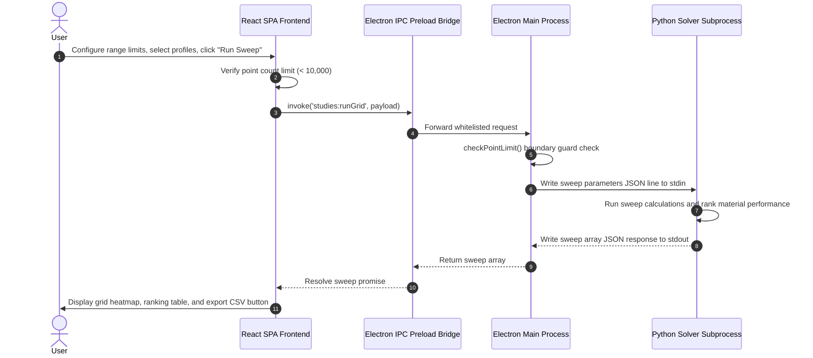
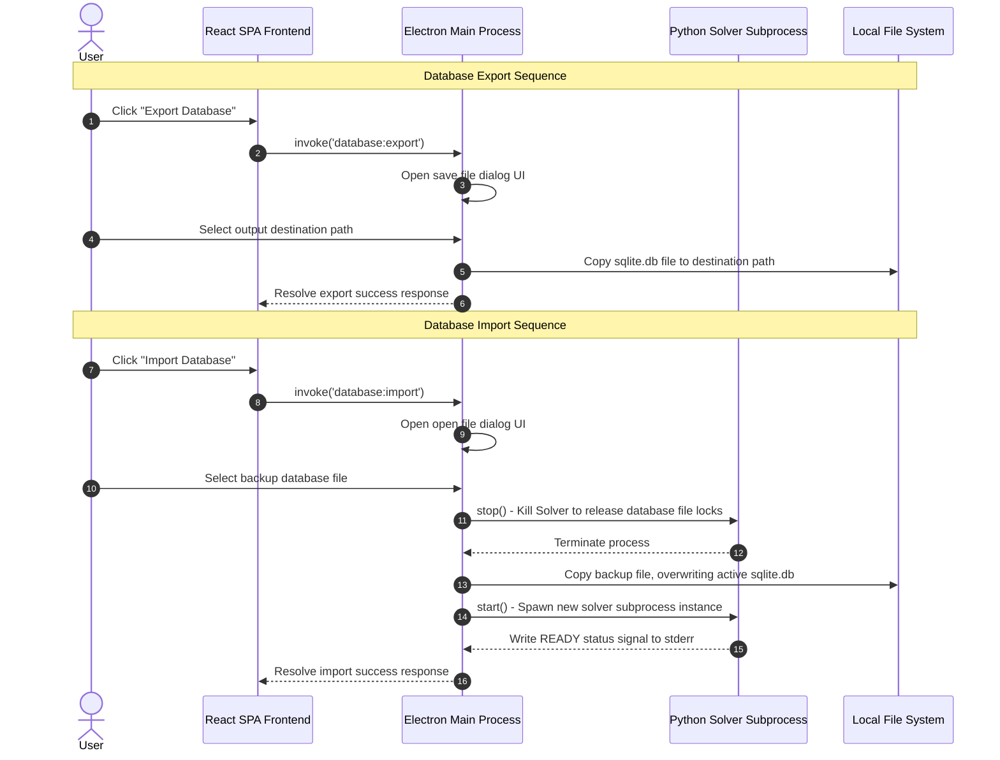
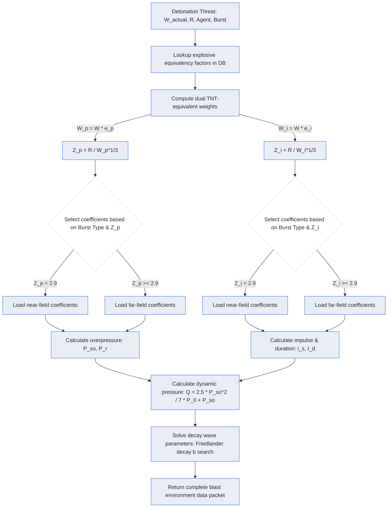
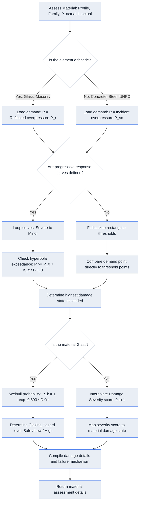

# BlastScope System Architecture & Engineering Documentation

This document describes the software architecture, database schema, IPC whitelists, process lifecycle, physics solver logic, mathematical formulations, and engineering principles of the BlastScope desktop application.

---

## 1. Application Overview

BlastScope is an offline, desktop-based, structural blast safety and hazard assessment platform. It enables engineers and defense analysts to simulate high-explosive detonations, calculate free-field and reflected shock wave parameters, perform dynamic damage assessments on construction materials (Glass, Brick Masonry, Reinforced Concrete, Structural Steel, Ultra-High Performance Concrete), and conduct parametric standoff/charge weight studies.

### 1.1 Architectural Philosophy
1.  **Strictly Offline**: Operating without external network dependencies, ensuring secure deployment in high-security research environments.
2.  **Decoupled Architecture**: Separation of UI rendering (React SPA) and heavy scientific computations (Python Solver).
3.  **Low-Latency Inter-Process Communication (IPC)**: Newline-separated JSON strings over standard input/output streams between Electron and Python.
4.  **Local SQLite Cache**: Efficient local storage with WAL (Write-Ahead Logging) mode to support concurrent operations.
5.  **Light Scientific Theme**: Designed as a neutral, light engineering workspace (reminiscent of professional software like MATLAB or ANSYS) to provide readability, visual clarity, and high contrast.



---

## 2. Frontend Architecture (React SPA)

The frontend is a single-page application built on **React (v18.3)**, **TypeScript**, **Vite (v5.0)**, and styled with vanilla CSS.

### 2.1 Screen Components Breakdown

#### 2.1.1 Scenario Input Screen (`src/screens/ScenarioInput.tsx`)
1.  **Purpose**: Captures user inputs to define an explosive blast threat.
2.  **User Actions**:
    *   Entering scenario name.
    *   Selecting explosive agent from a dropdown.
    *   Entering charge weight (mass).
    *   Entering standoff distance.
    *   Selecting burst type (Free Air, Air, Surface).
    *   Toggling unit systems (Metric vs. Imperial).
    *   Clicking "Save Scenario".
3.  **Implementing Files**: `src/screens/ScenarioInput.tsx`.
4.  **Data Flow**:
    *   Takes values from local state fields.
    *   Validates parameters.
    *   Invokes IPC API `scenarios:save` with the input payload.
    *   Receives scenario and assessment results, then updates the shared application context and sidebar list.
5.  **Calculations**:
    *   Unit conversion: If unit system is Imperial, converts inputs to metric base units before saving/saving results:
        *   $W_{kg} = W_{lb} \times 0.45359237$
        *   $R_{m} = R_{ft} \times 0.3048$
6.  **Scientific Equations**: Coordinates base parameters:
    *   $W_{eq} = W \times e$
    *   $Z = R / W^{1/3}$
7.  **Units**: Charge weight ($kg, lb$), distance ($m, ft$), burst type (dimensionless).
8.  **Outputs Generated**: Serialized scenario record, triggering database row insertions.
9.  **Plots Generated**: None.
10. **Engineering Interpretation**: Establishes the threat hazard benchmark (mass of charge and physical distance) for downstream structural safety assessments.

#### 2.1.2 Blast Results Screen (`src/screens/BlastResults.tsx`)
1.  **Purpose**: Renders the calculated free-field blast environment parameters and overlays.
2.  **User Actions**:
    *   Reviewing overpressure, impulse, duration, and arrival times.
    *   Toggling display units.
    *   Viewing pressure-time decay charts.
3.  **Implementing Files**: `src/screens/BlastResults.tsx`, `src/components/plots/BlastCurvePlot.tsx`.
4.  **Data Flow**:
    *   Reads scenario result metrics from context state.
    *   Calculates Friedlander decay parameters.
    *   Passes coordinates to the plot component.
5.  **Calculations**:
    *   Finds Friedlander decay coefficient $b$ using a numerical solver (secant/bisection root finder) to ensure the integrated area under the overpressure-time curve equals the positive impulse $i_s$:
        $$i_s = \int_0^{t_d} P_{so} \left(1 - \frac{t}{t_d}\right) e^{-b \frac{t}{t_d}} dt = P_{so} \frac{t_d}{b^2} \left(b - 1 + e^{-b}\right)$$
6.  **Scientific Equations**:
    *   Modified Friedlander decay curve:
        $$P(t) = P_{so} \left(1 - \frac{t}{t_d}\right) e^{-b \frac{t}{t_d}}$$
7.  **Units**: Overpressure ($kPa, MPa, psi, bar$), impulse ($kPa\cdot ms, psi\cdot ms$), duration/arrival time ($ms$).
8.  **Outputs Generated**: Numerical tables, conversion metrics, overpressure time-series.
9.  **Plots Generated**: Overpressure vs. time curve highlighting positive duration ($t_d$), peak overpressure ($P_{so}$), and arrival time ($t_a$).
10. **Engineering Interpretation**: Characterizes the blast wave load shape, detailing peak forces and dynamic impulse loads that strike target structures.

#### 2.1.3 Material Assessment Screen (`src/screens/MaterialAssessment.tsx`)
1.  **Purpose**: Displays structural damage states and safety zones for construction elements.
2.  **User Actions**:
    *   Selecting a material profile (Glass, Brick, Concrete, Steel, UHPC) from lists.
    *   Reviewing damage index, safety margins, and failure mechanisms.
    *   Viewing dynamic P-I overlay curves.
3.  **Implementing Files**: `src/screens/MaterialAssessment.tsx`, `src/components/plots/PIPlot.tsx`.
4.  **Data Flow**:
    *   Fetches assessments from active scenario results.
    *   Requests P-I curve coordinate points via IPC `materials:getPIEnvelopes`.
    *   Renders safety boundaries on the P-I chart.
5.  **Calculations**:
    *   Damage Index: $DI = \max\left(P_{actual}/P_{threshold}, I_{actual}/I_{threshold}\right)$.
    *   Glazing breakage probability: $P_b = 1.0 - e^{-0.693 (DI)^m}$.
6.  **Scientific Equations**:
    *   Glazing Weibull distribution:
        *   $m = 2.5$ for monolithic annealed glass.
        *   $m = 1.8$ for laminated glass.
    *   Hyperbolic curve boundaries:
        $$(P - P_0)(I - I_0) = K_c$$
7.  **Units**: Pressures ($kPa, psi$), impulses ($kPa\cdot ms, psi\cdot ms$), constants ($kPa^2\cdot ms$).
8.  **Outputs Generated**: Damage levels (Safe, Minor, Moderate, Severe, Failure) and dynamic mechanical states (e.g. Spalling, Yielding, PVB Tearing).
9.  **Plots Generated**: P-I Plot overlaying the threat demand point $(P, I)$ against hyperbolic boundaries for Minor, Moderate, Severe, and Failure damage states.
10. **Engineering Interpretation**: Evaluates element structural integrity, mapping load demand to failure probabilities and guiding reinforcing strategies.

#### 2.1.4 Research Workspace Screen (`src/screens/ResearchWorkspace.tsx`)
1.  **Purpose**: Enables side-by-side scenario comparisons and verification of the numerical solver.
2.  **User Actions**:
    *   Selecting multiple scenarios for radar comparison.
    *   Triggering model validation benchmark runs.
    *   Writing scientific notes in the notebook panel.
3.  **Implementing Files**: `src/screens/ResearchWorkspace.tsx`, `src/components/plots/RadarPlot.tsx`, `src/components/plots/ComparisonPlot.tsx`.
4.  **Data Flow**:
    *   Queries validation case databases using IPC `validation:getSummary`.
    *   Loads multi-scenario parameters for overlay.
    *   Saves research comments via `scenarios:saveNote`.
5.  **Calculations**:
    *   Relative Error: $e_{rel} = \frac{|x_{calc} - x_{ref}|}{x_{ref}} \times 100\%$
    *   Root Mean Square Error: $RMSE = \sqrt{\frac{1}{N}\sum (e_{rel})^2}$
6.  **Scientific Equations**: Standard statistical variance, RMSE, mean absolute percentage error (MAPE).
7.  **Units**: Relative errors ($\%), distances ($m$), masses ($kg$).
8.  **Outputs Generated**: RMSE error tables grouped by burst class (digitized, experimental, analytical), comparison indexes.
9.  **Plots Generated**:
    *   Radar Plot (comparing peak pressures, impulses, distances, weights).
    *   Comparison Plot (incident pressure/reflected pressure/impulse curves vs. standoff distance for multiple scenarios).
10. **Engineering Interpretation**: Assesses solver precision against reference databases (UFC 3-340-02, ConWep) to certify calculation accuracy.

#### 2.1.5 Parametric Study Screen (`src/screens/ParametricStudy.tsx`)
1.  **Purpose**: Evaluates structural response boundaries across varying standoffs and yields.
2.  **User Actions**:
    *   Configuring standoff sweeps, charge sweeps, or 2D grid sweeps.
    *   Defining range inputs (minimum, maximum, and step size).
    *   Selecting multiple target material profiles.
    *   Exporting calculation tables as CSV.
3.  **Implementing Files**: `src/screens/ParametricStudy.tsx`, `src/components/plots/SweepPlot.tsx`, `src/components/plots/HeatmapPlot.tsx`.
4.  **Data Flow**:
    *   Submits sweep ranges via IPC `studies:distanceSweep`, `studies:chargeSweep`, or `studies:runGrid`.
    *   Checks point limits ($N \le 10,000$).
    *   Processes flat sweep results, updates plots, and handles CSV exports.
5.  **Calculations**:
    *   Grid sweeps: evaluates every $(W, R)$ pair across selected profiles.
    *   Vulnerability score formulation:
        $$V = w_{sev} \cdot \bar{S} + w_{fail} \cdot \bar{R}_{fail} + w_{safe} \cdot \left(1.0 - \bar{R}_{safe}\right)$$
        Where $w_{sev}=0.4$, $w_{fail}=0.35$, $w_{safe}=0.25$.
6.  **Scientific Equations**:
    *   $\bar{S}$: Mean severity score.
    *   $\bar{R}_{fail}$: Normalized failure radius (against max failure radius in set).
    *   $\bar{R}_{safe}$: Inverted normalized safe standoff (smaller safe standoff indicates higher vulnerability).
7.  **Units**: Weights ($kg$), distance ($m$), vulnerability score ($[0,1]$).
8.  **Outputs Generated**: Standoff radii, vulnerability ranking lists, exported CSV databases.
9.  **Plots Generated**:
    *   Sweep Plot: Damage index vs. standoff/charge.
    *   Grid Heatmap: detonating charge vs. standoff distance color-coded by damage levels.
10. **Engineering Interpretation**: Identifies critical zones, safe zones, and lists materials by blast vulnerability ranking.

#### 2.1.6 Vulnerability Map Screen (`src/screens/VulnerabilityMap.tsx`)
1.  **Purpose**: Visualizes blast risk and safety regions spatially around a target center.
2.  **User Actions**:
    *   Selecting scenario and material profile.
    *   Adjusting zoom, grid resolution, and panning.
    *   Hovering over coordinates to inspect damage level.
3.  **Implementing Files**: `src/screens/VulnerabilityMap.tsx`, `src/components/RiskContourPanel.tsx`.
4.  **Data Flow**:
    *   Fetches the selected scenario results.
    *   Computes spatial grid coordinates.
    *   Determines scaled distance $Z$ and damage index at each pixel.
    *   Draws safety zones.
5.  **Calculations**:
    *   Euclidean distance: $R = \sqrt{(x - x_0)^2 + (y - y_0)^2}$.
    *   Computes blast parameters and evaluates material thresholds at distance $R$.
6.  **Scientific Equations**:
    *   $Z_{x,y} = R_{x,y} / W^{1/3}$
7.  **Units**: Coordinates ($m$), grid spacing ($m/pixel$).
8.  **Outputs Generated**: Interactive 2D spatial safety maps.
9.  **Plots Generated**: Grid-based risk contour overlays (Green = Safe, Yellow = Minor, Orange = Moderate, Red = Severe, Dark Red = Failure).
10. **Engineering Interpretation**: Assists planners in drafting security standoffs, building layouts, and exclusion zones.

#### 2.1.7 Documentation Screen (`src/screens/Documentation.tsx`)
1.  **Purpose**: Hosts reference materials, UFC details, and calculations manuals.
2.  **User Actions**:
    *   Searching and browsing chapters.
    *   Reviewing TNT equivalency factors.
3.  **Implementing Files**: `src/screens/Documentation.tsx`, `src/components/UfcExplorer.tsx`.
4.  **Data Flow**: Queries database references via `ufc:search` and displays search results.
5.  **Calculations**: Simple text parsing and matching.
6.  **Scientific Equations**: Displays text forms of Kingery-Bulmash and UFC equations.
7.  **Units**: Chapter, figure, and page indices.
8.  **Outputs Generated**: Reference search result lists.
9.  **Plots Generated**: None.
10. **Engineering Interpretation**: Provides design justification by mapping software calculations directly back to verified UFC 3-340-02 guidelines.

---

### 2.2 Shared UI Components

#### 2.2.1 Sidebar (`src/components/Sidebar.tsx`)
*   **Purpose**: Manages navigation, displays the scenario history index, and handles file import/export options.
*   **Trigger**: Clicking menu icons, choosing scenarios, or initiating database backup commands.
*   **Implementing Files**: `src/components/Sidebar.tsx`.
*   **Data Flow**: Fetches saved scenario lists, forwards selection states to main screens, and triggers file-system backup operations via Electron IPC.
*   **Calculations/Equations/Units**: None.
*   **Outputs**: Screen navigations, backup files, and restored database instances.
*   **Engineering Interpretation**: Unifies project files and case histories under a single project management dashboard.

#### 2.2.2 UFC Explorer (`src/components/UfcExplorer.tsx`)
*   **Purpose**: Sliding reference sheet to browse UFC design curves, formulas, and pages.
*   **Trigger**: Clicking the "UFC Reference Panel" toggle button.
*   **Implementing Files**: `src/components/UfcExplorer.tsx`.
*   **Data Flow**: Queries structural guidelines using keywords, displays figures and manuals.
*   **Calculations/Equations/Units**: None.
*   **Outputs**: Matching UFC standard figure details and manual page references.
*   **Engineering Interpretation**: Accelerates validation studies by serving as a reference companion.

#### 2.2.3 Report Generator (`src/components/ReportGenerator.tsx`)
*   **Purpose**: Generates and structures printable reports (Minimal Scenario, Multi-Scenario Comparison, Sweep & Benchmarks).
*   **Trigger**: Clicking "Print/Export PDF" buttons in results, research, or sweeps.
*   **Implementing Files**: `src/components/ReportGenerator.tsx`.
*   **Data Flow**: Aggregates calculations, validation errors, and scenario lists from application state, rendering a print-isolated layout.
*   **Calculations/Equations/Units**: Formats values to specified precision levels (e.g. 2 decimal places) and converts units.
*   **Outputs**: Printable DOM frames (invokes `window.print()`).
*   **Engineering Interpretation**: Acts as the primary engineering deliverable for safety review boards and structural approvals.

---

### 2.3 Shared Plots Components (`src/components/plots/`)

These components wrap **Recharts** or standard SVG canvas elements:

| Plot Component | Target Screen | Purpose / Output | Mathematical / Plotting Logic |
|---|---|---|---|
| **BlastCurvePlot** | Blast Results | Renders Friedlander decay curve ($P$ vs. $t$). | Samples overpressure values at 300 points from $t=0$ to $t=t_d \times 1.5$ using Friedlander decay. |
| **PIPlot** | Material Assessment | Renders hyperbolic thresholds and actual loading point. | Samples the hyperbola $P = P_0 + K_c / (I - I_0)$ from $I = 1.1 \cdot I_0$ to $I = 20,000$ on log scales. |
| **ComparisonPlot** | Research Workspace | Overlays pressure decay curves from multiple threats. | Draws overlapping series of overpressure waveforms. |
| **RadarPlot** | Research Workspace | Multi-parameter scenario comparison. | Plots normalized blast attributes on radial axes. |
| **SweepPlot** | Parametric Study | Plots damage levels vs. sweep distance/charge. | Connects calculated damage indexes or severity scores across step ranges. |
| **HeatmapPlot** | Parametric Study | 2D charge-standoff risk matrix. | Renders a color-blocked SVG grid representing safety margins. |
| **ThresholdOverlayPlot**| Material Assessment | Compares element thresholds. | Draws comparative bar plots of pressure/impulse capacities. |

---

## 3. Backend Architecture (Python Solver)

The backend solver is a standalone Python suite compiled with **PyInstaller** to run independently of system-level Python installations. It communicates with Electron over standard I/O streams using newline-separated JSON lines.

### 3.1 Python Solver Modules

```
backend/
├── main.py (Stdio IPC routing)
├── blast_engine/
│   ├── services/
│   │   └── blast_calculator.py (Scaling & coordination service)
│   ├── core/
│   │   ├── scaled_distance.py (Hopkinson-Cranz distance scaling)
│   │   ├── tnt_equivalence.py (Dual TNT equivalency mapping)
│   │   └── unit_converter.py (Physical unit conversion factors)
│   └── models/
│       ├── kingery_bulmash.py (Swisdak 1994 polynomial fits)
│       └── ufc_curves.py (Digitized UFC deviation model)
├── assessment/
│   └── damage_engine.py (Threshold & curve assessments)
├── materials/
│   ├── __init__.py (Registry map)
│   ├── base_material.py (Abstract base material class)
│   └── glass.py, masonry.py, rc.py, steel.py, uhpc.py (Element models)
├── studies/
│   ├── sweep_engine.py (Parametric standoff & weight sweeps)
│   ├── batch_runner.py (Matrix grids and CSV export)
│   └── material_ranker.py (Vulnerability ranking algorithms)
└── validation/
    └── scenario_validator.py (Parameter boundary validation)
```

#### 3.1.1 `main.py` (IPC Entrypoint)
*   **Purpose**: Standard I/O communication server. Receives JSON requests from stdin, routes them to calculations, queries SQLite, and writes JSON replies to stdout.
*   **User Actions**: Any interaction in the frontend (saves, calculations, sweeps) triggers this route.
*   **Implementing Files**: `backend/main.py`.
*   **Data Flow**:
    *   Reads `sys.stdin.readline()`.
    *   Deserializes JSON.
    *   Establishes SQLite connection, processes queries or calculations.
    *   Writes serialized JSON response to `sys.stdout`.
*   **Calculations/Equations/Units**: None directly (acts as router).
*   **Outputs**: Serialized JSON packets sent to standard output.
*   **Engineering Interpretation**: Serves as the central communication controller for the blast solver.

#### 3.1.2 `blast_calculator.py`
*   **Purpose**: Service layer coordinating blast parameter calculations.
*   **User Actions**: Saving scenarios or running manual calculations.
*   **Implementing Files**: `backend/blast_engine/services/blast_calculator.py`.
*   **Data Flow**: Takes physical weight/standoff inputs, applies TNT scaling factors, computes pressures and impulses, and packages outputs.
*   **Calculations/Equations/Units**:
    *   $W_p = W \times e_p$ (pressure-equivalent weight).
    *   $W_i = W \times e_i$ (impulse-equivalent weight).
    *   $W_g = W \times e_g$ (general-equivalent weight).
    *   $Z_p = R / W_p^{1/3}$ (pressure scaled distance).
    *   $Z_i = R / W_i^{1/3}$ (impulse scaled distance).
    *   $Z_g = R / W_g^{1/3}$ (general scaled distance).
*   **Outputs**: Structured dictionary containing peak pressures, impulses, durations, and arrival times.
*   **Engineering Interpretation**: Standardizes different explosive compounds to equivalent TNT yields using pressure- and impulse-specific scaling.

#### 3.1.3 `scaled_distance.py`
*   **Purpose**: Implements Hopkinson-Cranz blast standoff scaling.
*   **Implementing Files**: `backend/blast_engine/core/scaled_distance.py`.
*   **Scientific Equations**:
    $$Z = \frac{R}{W^{1/3}}$$
*   **Units**: Distance ($m$), weight ($kg$), scaled distance ($m/kg^{1/3}$).
*   **Engineering Interpretation**: Normalizes blast wave parameters, allowing comparison of varying combinations of charge weights and standoff distances.

#### 3.1.4 `tnt_equivalence.py`
*   **Purpose**: Computes dual pressure/impulse-specific TNT equivalent weights.
*   **Implementing Files**: `backend/blast_engine/core/tnt_equivalence.py`.
*   **Scientific Equations**:
    $$W = W_{actual} \times e$
*   **Units**: Weight ($kg$), equivalency factors (dimensionless).
*   **Engineering Interpretation**: Accounts for the differences in explosive behavior between chemical formulations (e.g. RDX vs. ANFO) across pressure and impulse regimes.

#### 3.1.5 `unit_converter.py`
*   **Purpose**: Standardizes physical measurements across metric and imperial systems.
*   **Implementing Files**: `backend/blast_engine/core/unit_converter.py`.
*   **Conversion Factors**:
    *   Pressure (Base: kPa): $MPa = 1000.0$, $psi = 6.894757$, $bar = 100.0$, $atm = 101.325$.
    *   Distance (Base: m): $ft = 0.3048$, $in = 0.0254$.
    *   Mass (Base: kg): $lb = 0.45359237$.
    *   Impulse (Base: kPa-ms): $psi\text{-}ms = 6.894757$.
*   **Engineering Interpretation**: Ensures consistent calculations by standardizing all internal solver variables to metric base units.

#### 3.1.6 `kingery_bulmash.py`
*   **Purpose**: Evaluates blast parameters using Swisdak (1994) polynomial fits.
*   **Implementing Files**: `backend/blast_engine/models/kingery_bulmash.py`.
*   **Scientific Equations**:
    $$\ln(Y) = \sum_{i=0}^4 C_i \left[\ln(Z)\right]^i$$
    Where $Y$ is pressure ($kPa$), impulse ($kPa\cdot ms$), arrival time ($ms$), or positive duration ($ms$), and $C_i$ represents burst-specific fitting coefficients.
    *   Rankine-Hugoniot Dynamic Pressure ($Q$):
        $$Q = \frac{2.5 P_{so}^2}{7 P_0 + P_{so}}$$
        Where $P_0 = 101.325$ kPa.
*   **Units**: Scaled distance ($m/kg^{1/3}$), pressure ($kPa$), impulse ($kPa\cdot ms$), durations ($ms$).
*   **Engineering Interpretation**: Standard empirical model for predicting free-field shock parameters.

#### 3.1.7 `ufc_curves.py`
*   **Purpose**: Simulates digitized UFC 3-340-02 curves by applying slight trace deviations (1.5% to 3.5%) to the Kingery-Bulmash curves.
*   **Implementing Files**: `backend/blast_engine/models/ufc_curves.py`.
*   **Scientific Equations**:
    $$P_{dev} = 1.02 - 0.012 \cdot \cos\left(\ln Z\right)$$
    $$I_{dev} = 0.98 + 0.015 \cdot \sin\left(\ln Z\right)$$
*   **Units**: Pressures scaled by $P_{dev}$, impulses scaled by $I_{dev}$.
*   **Engineering Interpretation**: Reproduces the minor variations typical of hand-digitized UFC charts.

#### 3.1.8 `damage_engine.py`
*   **Purpose**: Manages structural damage assessments for element models.
*   **Implementing Files**: `backend/assessment/damage_engine.py`.
*   **Data Flow**: Maps building elements to corresponding material models (e.g. Glass, Masonry, Concrete) and coordinates assessment evaluations.
*   **Calculations**: Loads the appropriate pressure metric (reflected pressure $P_r$ for facade Glass and Masonry; incident pressure $P_{so}$ for Concrete, Steel, and UHPC) and executes element-specific evaluations.
*   **Engineering Interpretation**: Evaluates element damage based on location (interior vs. exterior facades).

#### 3.1.9 `base_material.py`
*   **Purpose**: Abstract class defining default property extractions and P-I curve evaluations.
*   **Implementing Files**: `backend/materials/base_material.py`.
*   **Calculations**:
    *   Compares overpressure ($P$) and impulse ($I$) against hyperbolic boundaries:
        $$P \ge P_0 + \frac{K_c}{I - I_0}$$
    *   If no curves are present, falls back to rectangular boundaries.
*   **Engineering Interpretation**: Evaluates structural safety using simplified pressure-impulse threshold limits.

#### 3.1.10 Materials Subclasses (`glass.py`, `masonry.py`, `rc.py`, `steel.py`, `uhpc.py`)
*   **Purpose**: Implements mechanical properties and dynamic behavior classifications for specific construction materials.
*   **Implementing Files**: `backend/materials/glass.py`, `masonry.py`, `rc.py`, `steel.py`, `uhpc.py`.
*   **Calculations & States**:
    *   **Glass**: Evaluates breakage probability ($P_b$) and classifies hazard level (Glazing Safe, Low Hazard, High Hazard).
        $$P_b = 1.0 - e^{-0.693 (DI)^m}$$
        *   $m=2.5$ (annealed), $m=1.8$ (laminated).
    *   **Masonry**: Evaluates damage states: Elastic ($\le 0.24$), Cracking ($0.25 - 0.49$), Yielding ($0.50 - 0.74$), and Three-Hinge Collapse ($\ge 0.75$).
    *   **Reinforced Concrete**: Tracks damage progression from Elastic ($\le 0.19$) to Cracking ($0.20 - 0.39$), Spalling ($0.40 - 0.59$), Scabbing ($0.60 - 0.79$), and Breaching ($\ge 0.80$).
    *   **Structural Steel**: Evaluates plastic yielding thresholds, tracking response from Elastic ($\le 0.24$) to Yield ($0.25 - 0.49$), Membrane ($0.50 - 0.74$), and Tearing ($\ge 0.75$).
    *   **UHPC**: Analyzes high-ductility fiber performance, tracking states from Elastic ($\le 0.19$) to Micro-cracking ($0.20 - 0.39$), Fiber Activation ($0.40 - 0.59$), Fiber Pullout ($0.60 - 0.79$), and Localized Shear Failure ($\ge 0.80$).
*   **Engineering Interpretation**: Maps basic blast parameters to structural damage mechanisms (e.g. concrete scabbing or steel membrane tearing).

#### 3.1.11 `sweep_engine.py`
*   **Purpose**: Computes physical parameters over varying standoff ranges and charge weights.
*   **Implementing Files**: `backend/studies/sweep_engine.py`.
*   **Outputs**: Flat list of assessment records for each step in the parameter sweep.
*   **Engineering Interpretation**: Generates datasets used to identify critical damage transitions and safety boundaries.

#### 3.1.12 `batch_runner.py`
*   **Purpose**: Executes grid sweeps (charge $\times$ distance matrix) and exports results to CSV.
*   **Implementing Files**: `backend/studies/batch_runner.py`.
*   **Calculations**: Point count limits ($N = N_w \times N_r \times N_{profiles} \le 10,000$).
*   **Outputs**: Serialized grid results, output CSV files.
*   **Engineering Interpretation**: Automated tool for large-scale parametric hazard studies.

#### 3.1.13 `material_ranker.py`
*   **Purpose**: Computes material vulnerability scores and standoff safety metrics.
*   **Implementing Files**: `backend/studies/material_ranker.py`.
*   **Scientific Equations**:
    *   Inverted safe standoff score:
        $$S_{safe} = 1.0 - \frac{R_{safe}}{R_{safe, max}}$$
    *   Vulnerability score:
        $$V = 0.40 \cdot \bar{S} + 0.35 \cdot \frac{R_{fail}}{R_{fail, max}} + 0.25 \cdot S_{safe}$$
*   **Engineering Interpretation**: Identifies vulnerable components and quantifies safety zones.

#### 3.1.14 `scenario_validator.py`
*   **Purpose**: Validates input parameters to prevent solver singularities.
*   **Implementing Files**: `backend/validation/scenario_validator.py`.
*   **Constraints**:
    *   Charge Weight ($W$) must be $> 0$ kg.
    *   Standoff Distance ($R$) must be $\ge 0.1$ m.
    *   Burst Type must be "Free Air", "Air", or "Surface".
*   **Engineering Interpretation**: Prevents near-field calculations from producing mathematical singularities.

---

## 4. Database Architecture

BlastScope uses a local **SQLite3** database stored at `%APPDATA%/BlastScope/sqlite.db` in production. It operates under **Write-Ahead Logging (WAL)** mode to support concurrent operations.

### 4.1 Table Schema Breakdown

```sql
-- 1. explosives
CREATE TABLE explosives (
    id INTEGER PRIMARY KEY AUTOINCREMENT,
    name TEXT NOT NULL UNIQUE,
    pressure_equivalency REAL NOT NULL,
    impulse_equivalency REAL NOT NULL,
    general_equivalency REAL,
    detonation_velocity REAL,          -- m/s
    density REAL,                      -- g/cm³
    created_at TIMESTAMP DEFAULT CURRENT_TIMESTAMP
);

-- 2. materials
CREATE TABLE materials (
    id INTEGER PRIMARY KEY AUTOINCREMENT,
    family TEXT NOT NULL UNIQUE         -- e.g., 'Glass', 'Masonry', 'Concrete', 'Steel'
);

-- 3. material_profiles
CREATE TABLE material_profiles (
    id INTEGER PRIMARY KEY AUTOINCREMENT,
    material_id INTEGER NOT NULL,
    profile_name TEXT NOT NULL UNIQUE, -- e.g., 'Glass 6mm Monolithic'
    density REAL,                      -- kg/m³
    compressive_strength REAL,         -- MPa
    tensile_strength REAL,             -- MPa
    failure_mode TEXT,
    strain_rate_factor REAL,           -- dynamic increase factor (DIF)
    failure_category TEXT,
    damage_mechanism TEXT,
    notes TEXT,
    created_at TIMESTAMP DEFAULT CURRENT_TIMESTAMP,
    FOREIGN KEY (material_id) REFERENCES materials (id) ON DELETE CASCADE
);

-- 4. sources
CREATE TABLE sources (
    id INTEGER PRIMARY KEY AUTOINCREMENT,
    title TEXT NOT NULL,
    authors TEXT,
    year INTEGER,
    doi TEXT,
    url TEXT,
    notes TEXT,
    created_at TIMESTAMP DEFAULT CURRENT_TIMESTAMP
);

-- 5. thresholds
CREATE TABLE thresholds (
    id INTEGER PRIMARY KEY AUTOINCREMENT,
    profile_id INTEGER NOT NULL,
    source_id INTEGER,
    minor_pressure REAL,               -- kPa
    minor_impulse REAL,                -- kPa-ms
    moderate_pressure REAL,            -- kPa
    moderate_impulse REAL,             -- kPa-ms
    severe_pressure REAL,              -- kPa
    severe_impulse REAL,               -- kPa-ms
    failure_pressure REAL,             -- kPa
    failure_impulse REAL,              -- kPa-ms
    confidence_level TEXT,
    failure_description TEXT,
    threshold_source_type TEXT,
    applicability_notes TEXT,
    FOREIGN KEY (profile_id) REFERENCES material_profiles (id) ON DELETE CASCADE,
    FOREIGN KEY (source_id) REFERENCES sources (id) ON DELETE SET NULL
);

-- 6. scenarios
CREATE TABLE scenarios (
    id INTEGER PRIMARY KEY AUTOINCREMENT,
    name TEXT NOT NULL UNIQUE,
    explosive_id INTEGER NOT NULL,
    charge_weight REAL NOT NULL,       -- kg
    distance REAL NOT NULL,            -- m
    burst_type TEXT NOT NULL,          -- 'Free Air', 'Air', 'Surface'
    unit_system TEXT NOT NULL DEFAULT 'Metric',
    created_at TIMESTAMP DEFAULT CURRENT_TIMESTAMP,
    FOREIGN KEY (explosive_id) REFERENCES explosives (id)
);

-- 7. model_versions
CREATE TABLE model_versions (
    id INTEGER PRIMARY KEY AUTOINCREMENT,
    model_name TEXT NOT NULL,
    version TEXT NOT NULL,
    source_reference TEXT,
    created_at TIMESTAMP DEFAULT CURRENT_TIMESTAMP
);

-- 8. scenario_results
CREATE TABLE scenario_results (
    id INTEGER PRIMARY KEY AUTOINCREMENT,
    scenario_id INTEGER NOT NULL,
    model_version_id INTEGER,
    scaled_distance REAL NOT NULL,
    incident_pressure REAL NOT NULL,
    reflected_pressure REAL NOT NULL,
    dynamic_pressure REAL NOT NULL,
    positive_impulse REAL NOT NULL,
    positive_duration REAL NOT NULL,
    negative_duration REAL NOT NULL,
    arrival_time REAL NOT NULL,
    calculated_at TIMESTAMP DEFAULT CURRENT_TIMESTAMP,
    FOREIGN KEY (scenario_id) REFERENCES scenarios (id) ON DELETE CASCADE,
    FOREIGN KEY (model_version_id) REFERENCES model_versions (id) ON DELETE SET NULL
);

-- 9. material_response_curves
CREATE TABLE material_response_curves (
    id INTEGER PRIMARY KEY AUTOINCREMENT,
    profile_id INTEGER NOT NULL,
    damage_state TEXT NOT NULL,
    curve_type TEXT NOT NULL,         -- 'Hyperbolic'
    pressure_asymptote REAL,          -- P0 (kPa)
    impulse_asymptote REAL,           -- I0 (kPa-ms)
    curve_constant REAL,              -- Kc
    equation_text TEXT,
    source_id INTEGER,
    confidence_level TEXT,
    created_at TIMESTAMP DEFAULT CURRENT_TIMESTAMP,
    FOREIGN KEY (profile_id) REFERENCES material_profiles (id) ON DELETE CASCADE,
    FOREIGN KEY (source_id) REFERENCES sources (id) ON DELETE SET NULL
);

-- 10. material_assessments
CREATE TABLE material_assessments (
    id INTEGER PRIMARY KEY AUTOINCREMENT,
    scenario_result_id INTEGER NOT NULL,
    profile_id INTEGER NOT NULL,
    damage_level TEXT NOT NULL,
    damage_state TEXT,
    severity_score REAL,
    pressure_ratio REAL,
    impulse_ratio REAL,
    damage_index REAL,
    controlling_mode TEXT,
    damage_mechanism TEXT,
    assessment_reason TEXT,
    confidence_level TEXT,
    source_reference TEXT,
    response_model_version TEXT,
    created_at TIMESTAMP DEFAULT CURRENT_TIMESTAMP,
    FOREIGN KEY (scenario_result_id) REFERENCES scenario_results (id) ON DELETE CASCADE,
    FOREIGN KEY (profile_id) REFERENCES material_profiles (id) ON DELETE CASCADE
);

-- 11. validation_cases
CREATE TABLE validation_cases (
    id INTEGER PRIMARY KEY AUTOINCREMENT,
    charge_weight REAL NOT NULL,
    distance REAL NOT NULL,
    explosive_name TEXT NOT NULL DEFAULT 'TNT',
    burst_type TEXT NOT NULL DEFAULT 'Surface',
    scaled_distance REAL NOT NULL,
    reference_pressure REAL NOT NULL,
    reference_impulse REAL NOT NULL,
    calculated_pressure REAL,
    calculated_impulse REAL,
    pressure_abs_error REAL,
    pressure_rel_error REAL,
    impulse_abs_error REAL,
    impulse_rel_error REAL,
    validation_source TEXT,
    validation_page TEXT,
    reference_type TEXT,
    ground_truth_class TEXT,
    model_version_id INTEGER,
    validated_at TIMESTAMP DEFAULT CURRENT_TIMESTAMP,
    FOREIGN KEY (model_version_id) REFERENCES model_versions (id) ON DELETE SET NULL
);

-- 12. ufc_references
CREATE TABLE ufc_references (
    id INTEGER PRIMARY KEY AUTOINCREMENT,
    chapter TEXT NOT NULL,
    figure_number TEXT NOT NULL UNIQUE,
    title TEXT NOT NULL,
    category TEXT,
    keywords TEXT,
    description TEXT,
    source_page INTEGER
);

-- 13. unit_definitions
CREATE TABLE unit_definitions (
    id INTEGER PRIMARY KEY AUTOINCREMENT,
    quantity TEXT NOT NULL,
    unit_symbol TEXT NOT NULL UNIQUE,
    conversion_factor REAL NOT NULL,
    is_base INTEGER DEFAULT 0
);

-- 14. notes
CREATE TABLE notes (
    id INTEGER PRIMARY KEY AUTOINCREMENT,
    scenario_id INTEGER NOT NULL,
    note TEXT NOT NULL,
    created_at TIMESTAMP DEFAULT CURRENT_TIMESTAMP,
    FOREIGN KEY (scenario_id) REFERENCES scenarios (id) ON DELETE CASCADE
);
```

### 4.2 Database Migrations and Integrity
*   **Migration Framework**: Implements upgrades inside `DatabaseManager.run_migrations()`, logging applied schemas to `migration_history`.
*   **Idempotency**: Scans the migrations directory, checking `migration_history` to ensure migrations do not run twice.
*   **Fault Tolerance**: Automatically backs up database files prior to running schema migrations.
*   **Upgrade Paths**: Migrates structural databases incrementally from `v1`, `v2`, or `v3` schemas to the current `v4` production database layout.

---

## 5. IPC Whitelist & Electron Security Architecture

Electron manages the desktop shell, database access, subprocesses, and coordinates IPC communications between the frontend and the Python solver.

### 5.1 Context Isolation & Preload Configuration
Exposed in `electron/preload.ts`:
*   `contextIsolation` is enabled, and `nodeIntegration` is disabled.
*   The preload script validates and intercepts all incoming renderer requests against a strict whitelist of 30 standard channels (e.g. `scenarios:list`, `blast:calculateEnvironment`).
*   Direct access to the Node runtime, command execution, or file systems is blocked at the renderer layer.

### 5.2 Dynamic IPC Routing & Boundary Limits
*   `electron/main.ts` intercepts whitelisted renderer requests and routes them directly to the Python solver via standard I/O streams.
*   **Boundary Protection**: Before forwarding sweeps, the main process validates the total number of calculation points:
    $$N_{\text{points}} = N_{\text{charges}} \times N_{\text{standoffs}} \times N_{\text{profiles}}$$
    If $N_{\text{points}} > 10,000$, the request is immediately rejected at the IPC layer, preventing memory overflow.

### 5.3 Subprocess Management & Resiliency
The subprocess lifecycle is managed by the `PythonRunner` service in `electron/python-runner.ts`:

*   **Heartbeat Monitor**: Electron pings the solver process every 10 seconds.
*   **Timeout Detection**: If the solver process fails to reply within 5 seconds, it is assumed hung. Electron kills the process and spawns a new one.
*   **Fault-Tolerant Recovery**:
    *   Electron maintains a recovery counter.
    *   If the solver exits or crashes, Electron automatically attempts to restart the subprocess.
    *   If the subprocess crashes more than **3 times** within a single session, Electron halts recovery and redirects the frontend UI to a critical "Solver Process Crash Loop Detected" warning page.

---

## 6. Solver Calculations & Workflows

Detonation parameters are resolved step-by-step using scaled distance calculations:



### 6.1 Scaling & Polynomial Lookup
1.  **TNT Equivalent Weight**: Determines separate weights for pressure ($W_p$) and impulse ($W_i$) using chemical equivalency factors.
2.  **Scaled Distance**: Calculates pressure scaled distance $Z_p = R/W_p^{1/3}$ and impulse scaled distance $Z_i = R/W_i^{1/3}$.
3.  **Parameter Lookup**: Selects polynomial coefficients from the Kingery-Bulmash database based on burst type (Surface vs. Free Air) and scaled distance boundaries ($Z < 2.9$ vs. $Z \ge 2.9$).
4.  **Polynomial Evaluation**: Evaluates coefficients using:
    $$\ln(Y) = C_0 + C_1 \ln(Z) + C_2 \left[\ln(Z)\right]^2 + C_3 \left[\ln(Z)\right]^3 + C_4 \left[\ln(Z)\right]^4$$
    *   Calculates peak incident pressure ($P_{so}$) and reflected pressure ($P_r$) using $Z_p$.
    *   Calculates positive impulse ($i_s$) and positive duration ($t_d$) using $Z_i$.
5.  **Dynamic Pressure**: Calculates dynamic wind forces behind the shock front:
    $$Q = \frac{2.5 P_{so}^2}{7 P_0 + P_{so}}$$
6.  **Friedlander Waveform**: Fits the overpressure decay curve:
    $$P(t) = P_{so} \left(1 - \frac{t}{t_d}\right) e^{-b \frac{t}{t_d}}$$

### 6.2 Material Assessment Pipeline
1.  **Load Mapping**: Evaluates exterior facades using reflected pressure ($P_r$) and interior structures using incident pressure ($P_{so}$).
2.  **Hyperbolic P-I Check**: Evaluates loading against damage state envelopes:
    $$P_{actual} \ge P_0 + \frac{K_c}{I_{actual} - I_0}$$
3.  **Breakage Probabilities**: Glass breakage probability is predicted using a Weibull distribution:
    $$P_b = 1.0 - e^{-0.693 (DI)^m}$$
    Where $DI = \max\left(P_{actual}/P_{threshold}, I_{actual}/I_{threshold}\right)$ for the Minor threshold.
4.  **Severity Metrics**: Calculates damage severity scores ($[0,1]$) to classify structural failure levels (Safe, Minor, Moderate, Severe, Failure).

---

## 7. Data Flow Diagrams

### 7.1 Scenario Calculation and Material Assessment



### 7.2 Parametric Sweep and Material Ranking



### 7.3 Database Manual Export / Import and Solver Restart



---

## 8. Scientific Workflow Diagrams

### 8.1 Blast Wave Scaling Pipeline



### 8.2 Progressive Damage Assessment Pipeline


